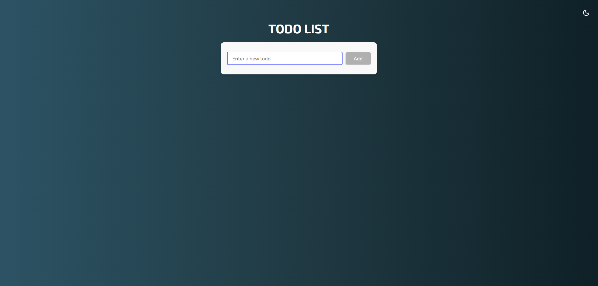

# 📝 Todo List App

A modern task management application built with React, TypeScript, and Firebase.

🔗 [Live Demo](https://evgeniyborysov.github.io/todo-list/)

## ✨ Features

-   📱 Responsive Design
-   🌓 Dark/Light Theme
-   🔥 Firebase Integration
-   💾 Local Storage Support
-   ⚡ Lightning Fast with Vite
-   🎨 Styled Components

## 🛠 Tech Stack

-   React 18
-   TypeScript
-   Redux Toolkit
-   Firebase
-   Styled Components
-   Vite
-   Redux Persist

## 🤝 Contributing

Pull requests are welcome. For major changes, please open an issue first to discuss what you would like to change.
